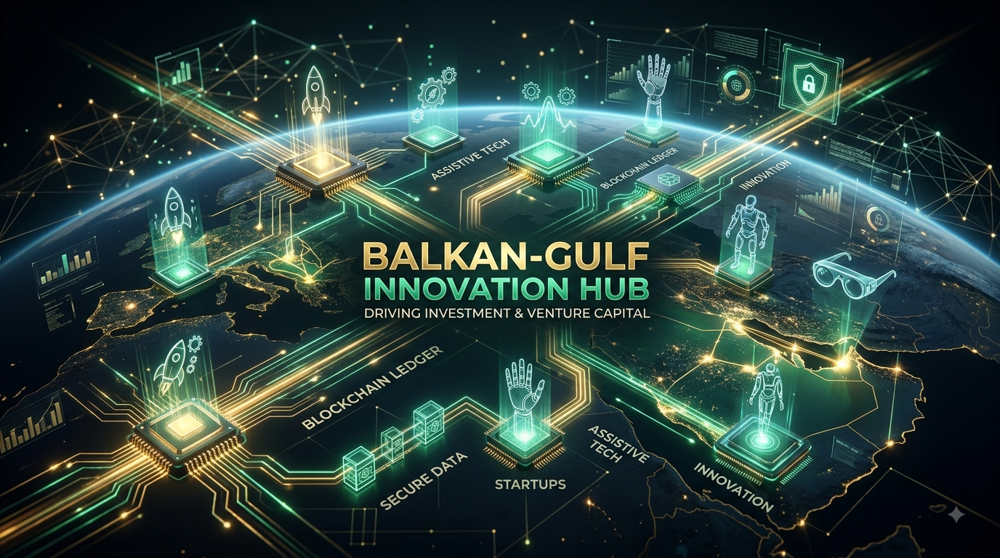

# 🌍 03. حاضنة بلقان-خليج للابتكار وريادة الأعمال النسائية
## إطار الاستثمار العابر للقارات، مسارات التجارة الرقمية، ومسرّعة مشاريع التقنيات المساعدة

---

<p align="center">
  
</p>

---

مرحباً بك في المجلد المخصص لـ **حاضنة بلقان-خليج للابتكار وريادة الأعمال النسائية**. توظيفاً للبُعد التاريخي، المعرفي، والدبلوماسي العريق لأسرة الثنيان الكريمة، تعمل هذه الحاضنة كجسر يربط بين الشركات الناشئة والمبتكرات في المحيط العربي (الخليج واليمن) مع الأسواق الأوروبية ومنطقة البلقان، مع وضع أولوية استراتيجية لتسريع المشاريع التي تطور **التقنيات المساعدة (Assistive Technology)** لخدمة ذوي متلازمة داون وذوي الإعاقة.

---

## 🚀 الركائز الاستراتيجية والآليات الاستثمارية الأساسية

تتكون البنية التشغيلية للحاضنة من ثلاثة مسارات متكاملة ومصممة لتوسيع نطاق الشركات الناشئة وتحقيق الدمج الاقتصادي الرقمي:

### 1. مسرّعة الأعمال الرقمية العابرة للحدود (🌐📈)
* **المفهوم:** تزويد الشركات التقنية الناشئة عالية النمو التي تقودها نساء بحزم الاحتضان، الإرشاد العالمي، والوصول المباشر إلى الأسواق الأوروبية.
* **نموذج التنفيذ:** بناء منصة سحابية لربط المؤسسات في الشرق الأوسط بصناديق رأس المال الجريء (VC) في أوروبا، وتوفير الأطر القانونية لتسريع تسجيل الشركات دولياً وإدارة العمليات الرقمية العابرة للحدود.

### 2. الصندوق المخصص لمنح وتمويل التقنيات المساعدة (🎗️💰)
* **المفهوم:** برنامج تمويل وتسريع تقني موجه حصرياً للمشاريع التي تبني حلولاً برمجية وهندسية لتمكين ذوي الإعاقة ومتلازمة داون.
* **نموذج التنفيذ:** توجيه التمويل الأولي، منح البحث والتطوير (R&D)، وإرشادات الملكية الفكرية لصالح الشركات الناشئة التي تطور أدوات النطق المدعومة بالذكاء الاصطناعي، الأجهزة الحسية، وأنظمة التعليم التكيفي، لتحويل الأثر الاجتماعي إلى نموذج تجاري مستدام.

### 3. سلاسل الإمداد الذكية ومسارات التجارة الرقمية (📦🚢)
* **المفهوم:** توطين تصنيع وتوزيع المنتجات التكيفية، المكونات الهندسية، والخدمات البرمجية بين الخليج، اليمن، ومنطقة البلقان.
* **نموذج التنفيذ:** إنشاء ممرات تجارة إلكترونية وأطر لوجستية تعتمد على بروتوكولات "البلوكشين" الناشئة لتأمين سلاسل الإمداد، وتقليل العوائق الجمركية أمام استيراد وتصدير أدوات التعليم المساعد والتقنيات الطبية.

---

## 📂 الهيكل المقترح للمجلد والمنظومة الاستثمارية (Directory Structure)

تم تنظيم هذا المجلد بشكل منهجي لاستيعاب محافظ المشاريع، الأطر القانونية، والنماذج الاستثمارية طبقاً للتقسيم التالي:

```text
├── README.md                           # ملف إستراتيجية الحاضنة والوصف الرئيسي (الحالي)
├── 01_venture_accelerator/             # أطر عمل الاحتضان وقواعد بيانات الإرشاد والتوجيه العالمي
│   ├── cohort_blueprints/             # معايير التقديم والجداول الزمنية التشغيلية للمجموعات
│   └── mentor_network/                # دليل الموجهين والخبراء التقنيين في أوروبا والعالم العربي
├── 02_assistive_tech_fund/             # مصفوفات الاستثمار لتقنيات متلازمة داون ودعم الإعاقة
│   ├── grant_allocation/              # معايير وشروط الامتثال لتوزيع المنح والتمويل الأولي
│   └── equity_models/                 # هياكل رأس المال الجريء ومقاييس عائد الاستثمار الاجتماعي
├── 03_supply_chain_logistics/         # أطر عمل التجارة الرقمية العابرة للحدود وسلاسل الإمداد
│   ├── market_analysis/               # دراسات الجدوى للممرات التجارية بين العالم العربي والبلقان
│   └── smart_contracts/               # نماذج العقود الذكية البرمجية لتأمين وتتبع الشحنات التقنية
└── 04_legal_compliance/                # السياسات القانونية ثنائية الولاية القضائية وأطر الملكية الفكرية
    ├── eu_regulations/                # المواءمة مع قوانين حماية البيانات الأوروبية (GDPR) وأفعال الوصول
    └── gcc_yemen_bylaws/              # قوانين حماية الاستثمار وأنظمة حماية براءات الاختراع المحلية
```

---

## 📈 خطة العمل والخطوات الاستراتيجية القادمة (Next Steps)
1. **صياغة معايير المنح:** بناء مصفوفة التقييم والامتثال الخاصة بـ *صندوق تمويل التقنيات المساعدة*.
2. **بناء الهيكل البرمجي للمنصة:** تصميم هياكل البيانات وبروتوكولات العقود الذكية لقاعدة بيانات المشاريع العابرة للحدود.
3. **رسم الخارطة الاستثمارية:** تحديد وفهرسة الشركاء الرئيسيين من صناديق رأس المال الجريء وحاضنات الأعمال في منطقة البلقان.

---
💡 *يعتبر هذا المجلد بيئة عمل برمجية واستشارية مفتوحة للمستثمرين، مهندسي التكنولوجيا المالية (FinTech)، خبراء سلاسل الإمداد، ومستثمري الأثر الاجتماعي.*


---

# 🌍 03. Balkan-Gulf Innovation & Female Entrepreneurship Hub
## Transcontinental Investment Framework, Digital Trade Routes, and Assistive Tech Venture Acceleration

---

<p align="center">
  
</p>

---

Welcome to the dedicated module for the **Balkan-Gulf Innovation & Female Entrepreneurship Hub**. Utilizing the historic intellectual, cultural, and diplomatic heritage of the Al-Thunayan family, this hub acts as a bridge connecting female-led startups and innovators in the Arab region (Gulf & Yemen) with European and Balkan markets. It places a strategic priority on accelerating ventures that develop **Assistive Technologies** for individuals with Down Syndrome and other disabilities.

---

## 🚀 Core Strategic Pillars & Investment Vehicles

The hub’s operational model is built around three integrated tech-business pathways designed to scale startups and catalyze economic inclusion:

### 1. The Cross-Border Digital Venture Accelerator (🌐📈)
* **Concept:** Providing high-growth, female-led tech startups with incubation, global mentorship, and direct access to European markets.
* **Execution Model:** Building a cloud-based venture portal that connects Middle Eastern founders with European venture capital (VC) funds, offering legal frameworks for fast-tracked international business registration and cross-border digital operations.

### 2. Assistive Technology (AT) Dedicated Grant & Seed Fund (🎗️💰)
* **Concept:** A targeted financial and technical acceleration program focused strictly on hardware and software solutions that empower individuals with disabilities and Down Syndrome.
* **Execution Model:** Directing seed funding, R&D grants, and intellectual property (IP) guidance towards startups developing AI-driven speech tools, sensory hardware, and adaptive learning devices, turning social impact into a scalable, sustainable business model.

### 3. Smart Supply Chain & Digital Trade Routes (📦🚢)
* **Concept:** Localizing the manufacturing and distribution of adaptive products, hardware components, and software services between the Gulf, Yemen, and the Balkans.
* **Execution Model:** Establishing e-commerce corridors and logistics frameworks that utilize emerging blockchain protocols to secure supply chains, reducing import/export barriers for assistive tech and educational tools.

---

## 📂 Proposed Directory & Financial Structure

This module is systematically organized to house venture portfolios, legal frameworks, and investment models as follows:

```text
├── README.md                           # Main hub strategy and framework file (Current)
├── 01_venture_accelerator/             # Incubation frameworks and global mentorship databases
│   ├── cohort_blueprints/             # Application standards and operational timelines
│   └── mentor_network/                # Directory of European and Arab tech mentors
├── 02_assistive_tech_fund/             # Investment matrices for Down Syndrome and disability tech
│   ├── grant_allocation/              # Criteria and compliance rules for seed funding
│   └── equity_models/                 # Venture capital structures and ROI impact metrics
├── 03_supply_chain_logistics/         # Cross-border digital trade and supply chain frameworks
│   ├── market_analysis/               # Feasibility studies for Arab-Balkan trade corridors
│   └── smart_contracts/               # Blockchain prototypes for supply chain security
└── 04_legal_compliance/                # Dual-jurisdiction legal policies and IP frameworks
    ├── eu_regulations/                # Alignment with European GDPR and accessibility acts
    └── gcc_yemen_bylaws/              # Investment protection acts and intellectual property rules
```

---

## 📈 Roadmap & Next Strategic Steps
1. **Drafting Fund Criteria:** Formulating the eligibility and compliance scoring matrix for the *Assistive Tech Dedicated Grant*.
2. **Architecture Setup:** Modeling the data structures and smart-contract protocols for the cross-border digital venture database.
3. **Ecosystem Mapping:** Identifying and cataloging key venture capital partners and incubator hubs across the Balkan region.

---
💡 *This directory is an open collaboration workspace for venture capitalists, fintech engineers, supply chain architects, and social impact investors.*
