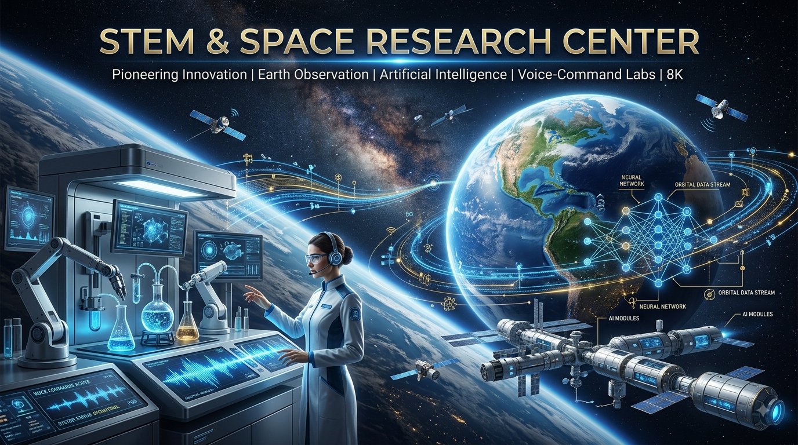

# 🤖 04. المركز الإقليمي لأبحاث الفضاء والذكاء الاصطناعي (STEM) للمرأة
## المواصفات الفنية، مسارات هندسة الفضاء، نماذج الذكاء الاصطناعي التوليدي، وبنية الأبحاث المهيأة للوصول الشامل

---

<p align="center">
  
</p>

---

مرحباً بك في المجلد المخصص لـ **المركز الإقليمي لأبحاث الفضاء والذكاء الاصطناعي (STEM) للمرأة**. مستلهمًا من الدبلوماسية الأكاديمية الدولية للأميرة لولوة الفيصل وتواصلها العميق مع مؤسسات عالمية عريقة مثل جامعة "توكاي" اليابانية وجامعة "سالفورد" البريطانية، يمثل هذا المركز مجمعاً علمياً متقدماً صُمم لتمكين العالمات والباحثات في هندسة الطيران والفضاء، معالجة بيانات الأقمار الصناعية، والذكاء الاصطناعي التوليدي، مع ضمان تهيئة البيئات الرقمية والمادية بالكامل لتكون تكيُّفية وملائمة للباحثات من ذوي الإعاقة والقدرات المختلفة.

---

## 🛰️ النطاقات العلمية ومسارات الهندسة الأساسية

تتكون العمليات التكنولوجية وقواعد البيانات البرمجية للمركز من ثلاثة مسارات هندسية متقدمة:

### 1. هندسة الفضاء ومسارات استشعار عن بُعد (🚀🛰️)
* **المفهوم:** بناء مسارات معالجة البيانات (Data Pipelines) لتحليل صور الأقمار الصناعية، محاكاة الميكانيكا المدارية، وتتبع القياسات عن بعد للمستشعرات الفضائية، تجسيداً للتعاون الأكاديمي مع جامعة توكاي.
* **البنية التحتية الفنية:** تطوير مسارات برمجية تعتمد على لغة (Python) والمكتبات الجغرافية المكانية (GDAL، Rasterio، Earth Engine API) للتتبع البيئي، ومراقبة المناخ، والتحليل الآلي للتضاريس عبر شبه الجزيرة العربية والقرن الأفريقي.

### 2. نماذج الذكاء الاصطناعي التوليدي والرؤية الحاسوبية التطبيقية (🤖🖥️)
* **المفهوم:** تطبيق نماذج التعلم العميق والشبكات العصبية المتقدمة لحل التحديات الإقليمية المعقدة وتحسين تشغيل الأنظمة التقنية المساعدة.
* **البنية التحتية الفنية:** تدريب وتحسين النماذج القائمة على المحولات (Transformers) ونماذج الرؤية الحاسوبية (PyTorch / TensorFlow) لتشغيل محركات النسخ السمعي البصري الآلي، والتعرف على الأشياء في الوقت الفعلي للروبوتات، والتحليلات التنبؤية المتخصصة لتقنيات الرعاية الصحية والوصول الشامل.

### 3. المختبرات البحثية المهيأة بيئياً وبيئات التطوير التكيفية (♿💻)
* **المفهوم:** هندسة المخططات المكانية للمختبرات المادية وسير العمل الرقمي لإزالة العوائق أمام العالمات المبدعات من ذوي الإعاقة أو ذوي السمات العصبية المختلفة (مثل متلازمة داون).
* **البنية التحتية الفنية:** دمج بروتوكولات الملاحة عبر تتبع حركة العين، وتهيئة بيئات التطوير المتكاملة (IDEs) لتكون متوافقة مع قارئات الشاشة، وتنفيذ أنظمة إنترنت الأشياء (IoT) داخل مختبرات الأجهزة للسماح بمعايرة الآلات والمعدات المختبرية بسلاسة عبر الأوامر الصوتية.

---

## 📂 الهيكل المقترح للمجلد والمنظومة البرمجية (Directory Structure)

تم تنظيم هذا المجلد بشكل منهجي لاستيعاب الأكواد البرمجية، أوزان نماذج الذكاء الاصطناعي، مخططات البنية التحتية، ووثائق التوأمة الأكاديمية طبقاً للتقسيم التالي:

```text
├── README.md                           # ملف استراتيجية المركز والوصف الفني الرئيسي (الحالي)
├── 01_aerospace_remote_sensing/        # خطوط معالجة بيانات الأقمار الصناعية وشفرات القياس الفضائي
│   ├── satellite_processing/          # سكربتات بايثون لمعالجة الصور والتحليل النقطي للخرائط
│   └── orbital_simulations/           # خوارزميات ماتلاب وبايثون لمحاكاة الديناميكيات المدارية
├── 02_applied_ai_cv/                  # شفرات ومستودعات التعلم العميق والشبكات العصبية
│   ├── computer_vision/               # برمجيات التعرف على الأشياء وتحليل بث الفيديو المباشر
│   └── generative_transformers/       # أكواد النماذج اللغوية (NLP) ونماذج النسخ الصوتي المدربة خصيصاً
├── 03_adaptive_lab_frameworks/        # أدوات الوصول الشامل وتكييف المختبرات الرقمية
│   ├── ide_accessibility_scripts/     # إضافات وأدوات تتبع العين/الصوت الموجهة لبيئات البرمجة
│   └── lab_iot_automation/            # برمجيات إنترنت الأشياء (C++) لأتمتة وتشغيل معدات المختبرات
└── 04_academic_twinning/               # بروتوكولات التوأمة ووثائق الأبحاث المشتركة
    ├── tokai_university_collab/       # أطر نقل التكنولوجيا وعلوم الفضاء مع جامعة توكاي اليابانية
    └── salford_university_collab/      # سجلات التوأمة في مجالات التصنيع الرقمي والروبوتات مع جامعة سالفورد
```

---

## 📈 خطة العمل والخطوات الاستراتيجية القادمة (Next Steps)
1. **بناء النموذج الأولي للمسار الرقمي:** كتابة السكربت البرمجي الأول لاستخراج ومعالجة صور الأقمار الصناعية (Sentinel/Landsat).
2. **تطوير أدوات البرمجة الميسرة:** تجميع حزمة إضافات مخصصة لبيئة (VS Code) مهيأة لتوليد الأكواد عبر الأوامر الصوتية وتتبع حركة العين.
3. **تفعيل سجلات التوأمة:** وضع المتطلبات التشغيلية لمشاركة بيانات القياس عن بُعد المشتركة مع المحطات الأرضية للجامعات الدولية.

---
💡 *يعتبر هذا المجلد بيئة عمل هندسية مفتوحة لمهندسي الفضاء، باحثي الذكاء الاصطناعي، أخصائيي واجهات الوصول الشامل (UI/UX Accessibility)، وعلماء البيانات.*


---

# 🤖 04. Regional STEM & Space Research Center for Women
## Technical Specification, Aerospace Pipelines, Generative AI Models, and Accessible Research Infrastructure

---

<p align="center">
  
</p>

---

Welcome to the dedicated module for the **Regional STEM & Space Research Center for Women**. Inspired by Princess Loulwa Al-Faisal's international academic diplomacy and deep networking with elite institutions like Japan's Tokai University and the UK's University of Salford, this center serves as an advanced scientific complex designed to empower female scientists in aerospace engineering, satellite data processing, and Generative AI, while ensuring fully accessible and adaptive digital and physical environments for researchers with diverse abilities.

---

## 🛰️ Core Scientific Domains & Engineering Workflows

The center's technological operations and codebases are structured into three main advanced engineering tracks:

### 1. Aerospace Engineering & Remote Sensing Pipeline (🚀🛰️)
* **Concept:** Building data pipelines to process satellite imagery, orbital mechanics simulations, and space-bound sensor telemetry, rooted in the academic collaboration with Tokai University.
* **Technical Architecture:** Developing Python-based pipelines utilizing geospatial libraries (GDAL, Rasterio, Earth Engine API) for environmental tracking, climate monitoring, and automated terrain analysis across the Arabian Peninsula and the Horn of Africa.

### 2. Applied Generative AI & Computer Vision Models (🤖🖥️)
* **Concept:** Implementing cutting-edge Deep Learning and Neural Network models to solve complex regional challenges and optimize assistive system operations.
* **Technical Architecture:** Training and fine-tuning Transformer-based architectures and Computer Vision models (PyTorch / TensorFlow) to power automated audio-visual transcription engines, real-time object detection for robotics, and specialized predictive analysis for healthcare and accessibility technologies.

### 3. Accessible Research Labs & Adaptive IDEs (♿💻)
* **Concept:** Engineering physical space blueprints and digital workflows to eliminate barriers for brilliant female scientists with disabilities or neurodivergent profiles (such as Down Syndrome).
* **Technical Architecture:** Integrating eye-tracking navigation protocols, screen-reader optimized Integrated Development Environments (IDEs), and implementing IoT-driven spatial automation within the hardware labs to allow seamless, voice-commanded lab machinery calibration.

---

## 📂 Proposed Directory & Repository Structure

This module is systematically organized to house source codes, AI model weights, architecture blueprints, and twinning frameworks as follows:

```text
├── README.md                           # Main center strategy and technical framework file (Current)
├── 01_aerospace_remote_sensing/        # Satellite data pipelines and space telemetry scripts
│   ├── satellite_processing/          # Python scripts for image processing and raster analysis
│   └── orbital_simulations/           # MATLAB / Python algorithms for orbital dynamics
├── 02_applied_ai_cv/                  # Deep learning models and neural network codebases
│   ├── computer_vision/               # Object detection and video-feed analysis scripts
│   └── generative_transformers/       # Custom-trained NLP and transcription model code
├── 03_adaptive_lab_frameworks/        # Tools for accessibility and digital lab adaptation
│   ├── ide_accessibility_scripts/     # Extensions and voice/eye-tracking tools for coding environments
│   └── lab_iot_automation/            # C++ firmware for automated, accessible lab equipment
└── 04_academic_twinning/               # Transfer protocols and joint research documentation
    ├── tokai_university_collab/       # Aerospace and technology transfer frameworks
    └── salford_university_collab/      # Digital manufacturing and robotics twinning logs
```

---

## 📈 Roadmap & Next Strategic Steps
1. **Pipeline Prototyping:** Writing the initial data extraction script for Sentinel/Landsat satellite imagery processing.
2. **Accessible Coding Tools:** Bundling a localized VS Code extension suite optimized for voice and eye-tracking code generation.
3. **Twinning Logs:** Outlining the operational requirements for joint telemetry data sharing with international university ground stations.

---
💡 *This directory is an open engineering workspace for AI researchers, aerospace engineers, UI/UX accessibility specialists, and data scientists.*
